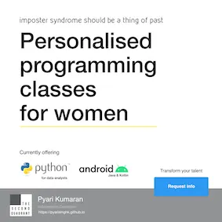

# Python Training Cheatsheets (2020)

In an era where AI is rapidly transforming coding, this repository holds a special place for me. It's a reminiscence of an old repo, initially prepared as cheatsheets for my students whom I taught in 2020. More recently, I updated this repository for a small batch of school students I trained.

The training poster is a fond memory from those days. It was designed by my good friend Muneer Marath.

